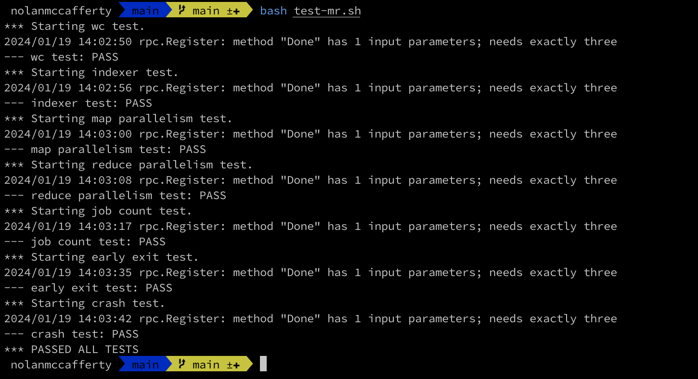

# MIT-6.5840-Distribute-Systems

This is the set of labs from the MIT 6.5840 Distributed Systems class which is available for free on [MIT OpenCourseWare](https://pdos.csail.mit.edu/6.824/index.html). 
I followed this online course independently during the 2023-2024 winter.  

## Lab 1: MapReduce

[Lab Instructions](https://pdos.csail.mit.edu/6.824/labs/lab-mr.html)

In this lab I modified `mr/coordinator.go`, `mr/worker.go` and `mr/rpc.go` to complete the MapReduce implementation.



Use the following commands to run the test suite:

```$xslt
$ git clone https://github.com/NolanJMcCafferty/MIT-6.5840-Distribute-Systems.git
$ cd ~/6.5840/src/main
$ bash test-mr.sh
```

and to run the test suite `x` times in a row:

```$xslt
$ bash test-mr-many.sh x
```